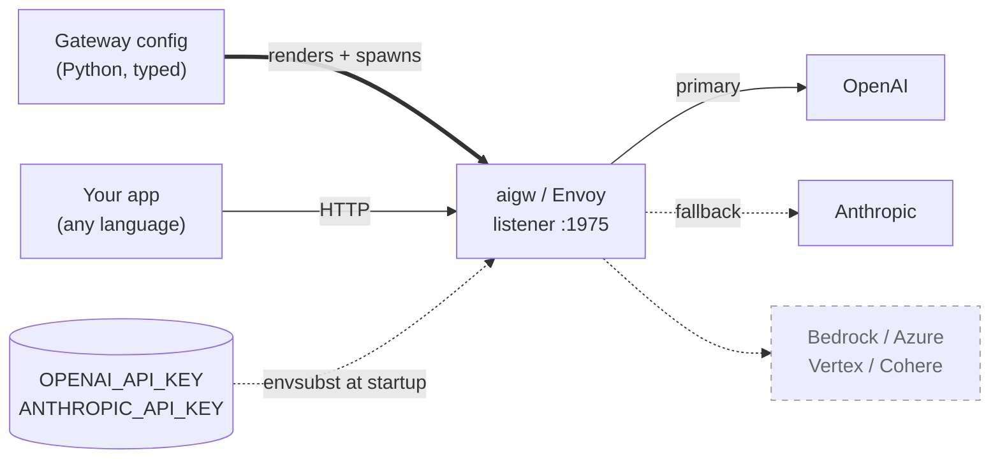

# envoyai

**A production-grade LLM gateway, configured in Python.**
Routing, retries, fallbacks, provider translation, and auth injection run
in a real [Envoy AI Gateway](https://github.com/envoyproxy/ai-gateway)
process — not inside your Python code. No YAML. No Kubernetes. No
client-side provider juggling.

## 30-second demo

```bash
pip install envoyai
export OPENAI_API_KEY=sk-...
```

```python
import envoyai as ea
resp = ea.complete(
    model="gpt-4o-mini",
    messages=[{"role": "user", "content": "hi"}],
)
```

Under the hood, envoyai spawned an `aigw` subprocess, pointed a listener
at `127.0.0.1:1975`, auto-registered `gpt-*` against OpenAI, and routed
your call through it. The real API key never touched the Python client.

## How it fits together



You define a `Gateway` in typed Python. envoyai renders it to a
multi-doc YAML and hands it to the pinned `aigw` binary, which starts an
Envoy listener and handles every request from there. Your app — Python,
Node, Go, curl, whatever — speaks plain OpenAI-format HTTP to the
listener and sees identical behavior regardless of which upstream
actually served the request. API keys enter the gateway process via env
vars at startup and never leave it.

## Full example

```python
import envoyai as ea

openai    = ea.OpenAI(api_key=ea.env("OPENAI_API_KEY"))
anthropic = ea.Anthropic(api_key=ea.env("ANTHROPIC_API_KEY"))

gw = ea.Gateway()
gw.model("chat").route(
    primary=openai("gpt-4o"),
    fallbacks=[anthropic("claude-sonnet-4")],
    retry=ea.RetryPolicy.rate_limit_tolerant(),
)
gw.model("fast").route(primary=openai("gpt-4o-mini"))

gw.local()                                  # background aigw subprocess
resp = gw.complete("chat", "hi")            # retry + fallback applied
print(resp.choices[0].message.content)
```

Same `Gateway` works in proxy mode — swap `gw.local()` for `gw.serve()`
(blocks the process) and call from any OpenAI-compatible client:

```python
from openai import OpenAI
client = OpenAI(base_url="http://127.0.0.1:1975", api_key="unused")
client.chat.completions.create(
    model="chat",
    messages=[{"role": "user", "content": "hi"}],
)
```

```bash
curl http://127.0.0.1:1975/v1/chat/completions \
  -H 'Content-Type: application/json' \
  -d '{"model":"chat","messages":[{"role":"user","content":"hi"}]}'
```

## Three entry points

| Style | Snippet | When to use |
|---|---|---|
| **Two-liner** [`examples/00`](examples/00_two_liner.py) | `ea.complete(model=..., messages=...)` | Quick scripts, trying things out |
| **SDK mode** [`examples/a`](examples/a_sdk_mode.py) | `gw.local()` + `gw.complete()` | Explicit gateway, same process |
| **Proxy mode** [`examples/b`](examples/b_proxy_mode/) | `gw.serve()` + any OpenAI client | Multi-language, shared dev / prod |

Same `Gateway` config drives all three.

## Today's runtime

`gw.local()` / `gw.serve()` actually render and run for this surface:

| | Status |
|---|---|
| **Providers** — `OpenAI`, `Anthropic` (native API), coexisting in one `Gateway` | ✅ ready |
| **Auth** — `ea.env(...)` rendered as `${VAR}` for `aigw` envsubst | ✅ ready |
| **Routing** — one primary per route + ordered `fallbacks=[...]` chain | ✅ ready |
| **Retry / failover** — `RetryPolicy` → aigw `BackendTrafficPolicy` (attempts, per-retry timeout, backoff, product-level reasons) | ✅ ready |
| **Binary management** — auto-download of the pinned `aigw` on first call | ✅ ready |
| **Providers** — Bedrock, Azure, Vertex, Cohere, AWSAnthropic, GCPAnthropic | 🚧 gated (builder accepts, renderer errors clearly) |
| **Routing** — weighted `Split`, differing `RetryPolicy` per route | 🚧 gated |
| **Policies** — `Budget`, custom `Timeouts` | 🚧 gated |
| **Outputs** — `render_k8s()` / `apply()` / `deploy()` / `diff()` | 🚧 stubs |

Gated items raise a clear `NotImplementedError` from the renderer rather
than silently doing less than you asked — see [CHANGELOG.md](CHANGELOG.md)
for release-by-release progress.

## Why envoyai

- **The proxy is Envoy, not Python.** Routing, retries, circuit
  breaking, and cost attribution run in a subprocess. Python clients
  point at `http://127.0.0.1:<port>` with a placeholder `api_key="unused"`;
  the real upstream key lives server-side.
- **Every language, one config.** Any OpenAI-compatible client —
  Python, Node, Go, Ruby, curl — sees identical behavior without a
  per-language SDK.
- **Typed Python, not growing YAML.** Providers, routes, fallbacks,
  retries, and budgets are Pydantic-validated objects with IDE
  autocomplete. `Gateway._validate()` reports every problem in a single
  error before any subprocess starts.
- **No module-level mutable state.** All configuration lives on a
  `Gateway` instance; a regression test fails the build if anyone adds
  global config knobs at `envoyai.*`.
- **Cost from metrics, not hardcoded tables.** Spend will be computed
  from gateway-emitted token counts against
  [versioned price sheets](src/envoyai/_internal/prices/). Historical
  queries use the sheet in effect at the time of the request.
- **Safe-by-default privacy.** Auth headers redacted; prompt and
  response bodies stay out of logs and callbacks unless you opt in via
  `gw.privacy(...)`.
- **Structured, typed errors** with always-populated fields
  (`retry_after_s`, `provider`, `model`, `trace_id`) and a `.cause`
  attribute for underlying exceptions.

## Install

```bash
pip install envoyai              # library (OpenAI SDK included)
pip install envoyai[admin]       # + admin UI backend (coming)
pip install envoyai[dev]         # + pytest, mypy, ruff for contributors
```

On the first call to `gw.local()` / `gw.serve()`, envoyai downloads the
pinned [`aigw`](https://github.com/envoyproxy/ai-gateway) binary into
`~/.cache/envoyai/bin/` and runs from there — no Go toolchain required.
Subsequent calls reuse the cache.

Escape hatches for the auto-download:

| | |
|---|---|
| **Pre-fetch** | `envoyai download-aigw` (CI, Dockerfile `RUN`, air-gapped installs) |
| **Bring your own binary** | `export ENVOYAI_AIGW_PATH=/path/to/aigw` |
| **Use a `$PATH` install** | `brew install aigw` or `go install github.com/envoyproxy/ai-gateway/cmd/aigw@latest` — `$PATH` wins over the cache |
| **Check what got resolved** | `envoyai where` |

Supported auto-download targets: `linux/amd64`, `linux/arm64`,
`darwin/arm64`. Other platforms: build locally and set
`ENVOYAI_AIGW_PATH`.

## Providers

Typed classes for every backend: `OpenAI`, `AzureOpenAI`, `Bedrock`,
`AWSAnthropic`, `Anthropic`, `Cohere`, `GCPVertex`, `GCPAnthropic`, and
any OpenAI-compatible endpoint (vLLM, Ollama, text-generation-inference,
self-hosted proxies) by passing `base_url` to `OpenAI`.

The builder accepts all of them today; see **Today's runtime** above for
what actually renders to `aigw`.

## Examples

[`examples/`](examples/) has one short, self-contained script per task.

| # | File | What it shows |
|---|---|---|
| 00 | [two_liner](examples/00_two_liner.py) | `ea.complete()` with auto-registration |
| 01 | [hello_world](examples/01_hello_world.py) | Single provider, one logical model |
| 02 | [multi_provider](examples/02_multi_provider.py) | All eight providers in one gateway |
| 03 | [failover](examples/03_failover.py) | Primary + fallback chain with retries |
| 04 | [canary](examples/04_canary.py) | 90/10 weighted split for gradual rollouts |
| 05 | [streaming](examples/05_streaming.py) | Streaming completions |
| 06 | [tool_use](examples/06_tool_use.py) | Function / tool calling |
| 07 | [embeddings](examples/07_embeddings.py) | Embedding endpoints |
| 08 | [vision](examples/08_vision.py) | Multi-modal (image) inputs |
| 09 | [async](examples/09_async.py) | Async / concurrent requests |
| 10 | [custom_retry](examples/10_custom_retry.py) | Retry on product-level reasons |
| 11 | [budget_per_team](examples/11_budget_per_team.py) | Per-team spend caps |
| 12 | [model_alias](examples/12_model_alias.py) | Vendor-agnostic model names |
| 13 | [local_openai_compat](examples/13_local_openai_compat.py) | vLLM / Ollama / self-hosted |
| 14 | [privacy](examples/14_privacy.py) | Redaction defaults and overrides |
| 15 | [handling_errors](examples/15_handling_errors.py) | Build-time and request-time errors |

## Status

Alpha. Shipped today:

- **Builder API** — `Gateway`, eight provider classes, auth helpers
  (env/secret/header + `aws`/`azure`/`gcp`), `RetryPolicy` / `Budget` /
  `Privacy` / `Timeouts`, typed errors.
- **Runtime** — `Gateway.local()` (background subprocess),
  `Gateway.serve()` (foreground), `Gateway.complete()` / `acomplete()`,
  module-level `envoyai.complete()` / `acomplete()` backed by an implicit
  singleton.
- **Renderer** — `OpenAI` and `Anthropic`, primary + ordered
  `fallbacks=[...]`, `RetryPolicy` via `BackendTrafficPolicy`,
  `ea.env(...)` auth. Each additional API-key provider is a one-row
  registry addition.
- **Binary management** — first-call auto-download of the pinned `aigw`,
  `envoyai download-aigw` / `where` / `version` CLI, `ENVOYAI_AIGW_PATH`
  escape hatch.

Coming, roughly in order:

1. **Bedrock renderer** (three AWS credential modes).
2. **Timeouts**, weighted Split, aliases.
3. **Cost ledger** against versioned price sheets; then `Budget` alerts
   and enforcement.
4. **Azure**, Cohere, GCP Vertex, AWSAnthropic, GCPAnthropic renderers.
5. **Kubernetes output** — `render_k8s()` / `apply()` / `deploy()` /
   `diff()`.
6. **Framework integrations** — first-class recipes and thin helpers
   for running agents against an envoyai-managed gateway. Starting with
   [Google ADK](https://github.com/google/adk-python): ADK agents point
   at the local `:1975` listener through ADK's OpenAI-compatible model
   plug-in, so routing, fallback, retry, and cost attribution happen
   once at the gateway instead of per-agent. LangGraph / LlamaIndex
   recipes to follow.
7. **Admin UI** backend + SPA.

Track every release in [`CHANGELOG.md`](CHANGELOG.md).

---

Developed at [github.com/botengyao/envoyai](https://github.com/botengyao/envoyai).
